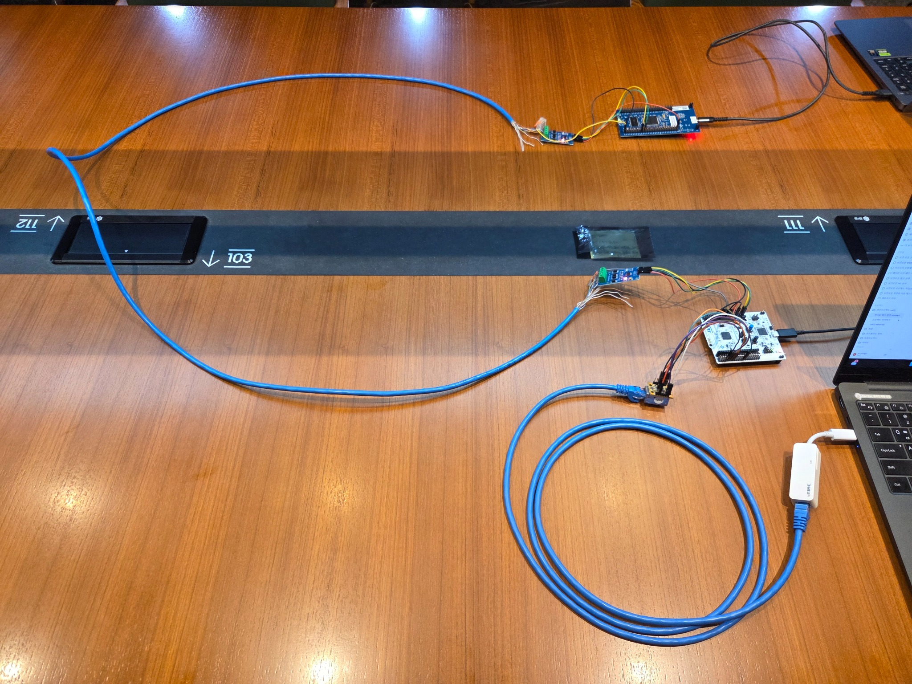
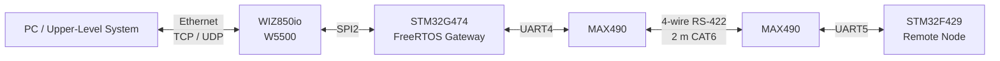
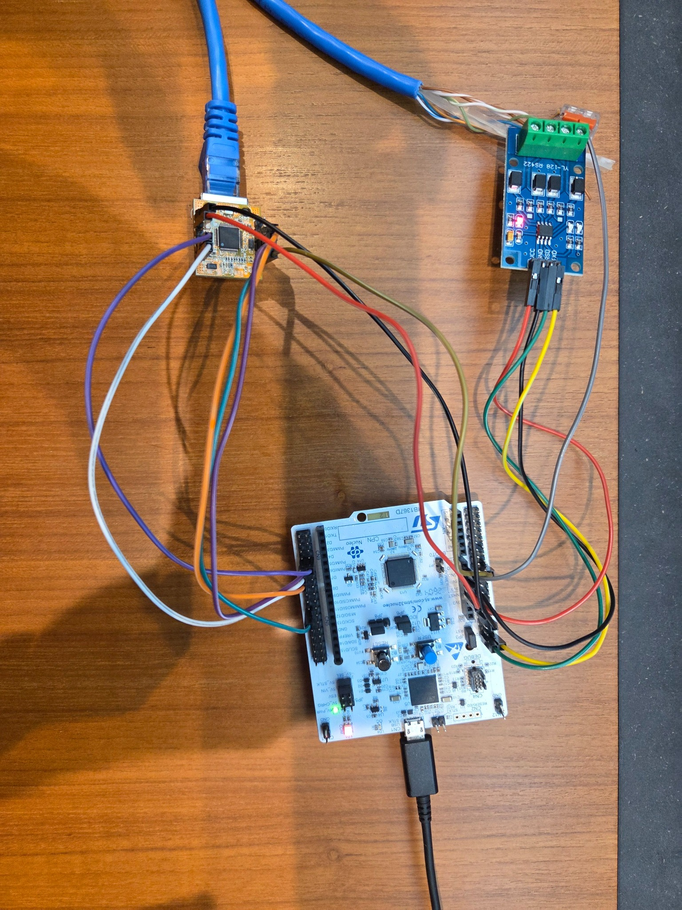
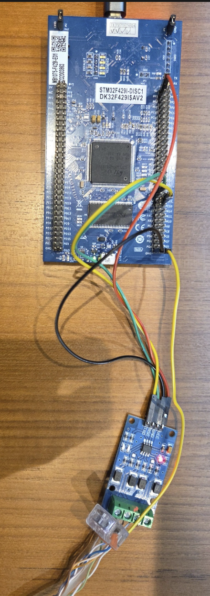

# Ethernet–RS-422 Gateway


<p align="center">
  
</p>
<p align="center"><sub>PC–W5500–STM32G474 Gateway–2 m RS-422–STM32F429 Remote Node 전체 실험 구성</sub></p>

Ethernet 기반 상위 시스템과 RS-422 기반 임베디드 장치 사이를 연결하는 STM32/FreeRTOS 통신 Gateway이다.

TCP Command/Response와 UDP Telemetry를 RS-422 Remote Node로 중계하고, 통신 단절·Remote MCU Reset·Ethernet 재연결 상황에서도 Gateway를 Reset하지 않고 정상 통신으로 복귀하도록 구현했다.

---

## 기능

- Ethernet TCP ↔ RS-422 Command / Response
- UDP 기반 주기 Telemetry
- FreeRTOS Task / Queue 기반 통신 처리
- UART Interrupt + Ring Buffer 기반 비동기 수신
- Application Protocol V1 + CRC-16/CCITT-FALSE
- Sequence 기반 Request / Response Matching
- Heartbeat / Timeout 기반 Remote 상태 감시
- RS-422 단선 / Remote Reset / Ethernet Disconnect 자동 복구

### 결과 요약

| 항목 | 결과 |
| --- | --- |
| Protocol / Parser | **17 / 17 PASS** |
| F429 Remote Node | **30 / 30 PASS** |
| RS-422 PING/PONG | **100 / 100 PASS** |
| TCP E2E | **300 / 300, Timeout 0** |
| TCP RTT | **Avg 5.223 ms** |
| TCP Jitter | **Avg 0.545 ms** |
| UDP | **1000 / 1000, Loss 0.00%** |
| TCP + UDP 동시 | **TCP 300 / 300 + UDP 1000 / 1000** |
| RS-422 Recovery | **Avg 29.3 ms** |
| F429 Recovery | **Avg 22 ms** |
| Ethernet Recovery | **3 / 3 PASS, MCU Reset 없음** |
| CRC Fault | **3 / 3 PASS** |

---

## 전체 구조



PC와 Gateway 사이는 Ethernet, Gateway와 Remote Node 사이는 4-wire RS-422로 구성했다.

TCP는 명령/응답, UDP는 Telemetry 경로로 사용하고 G474 Gateway가 두 통신 구간 사이의 Routing과 상태 관리를 담당한다.

---

## FreeRTOS Gateway

RS-422 처리, Ethernet 송수신, 통신 상태 감시를 Task로 분리했다.

| Task | Priority | 역할 |
| --- | --- | --- |
| `RS422Task` | High | UART4 RX/TX, Stream Parser, Protocol Routing |
| `EthernetTask` | Normal | SPI2/W5500, TCP/UDP 처리 |
| `HealthTask` | Low | Remote 통신 상태 및 Timeout 감시 |

UART4는 `RS422Task`, SPI2/W5500은 `EthernetTask`만 직접 접근하도록 Peripheral Ownership을 나눴다.

Task 간에는 Packet을 Queue로 전달한다.

```text
rs422_cmd_queue
Ethernet → RS-422 Command

tcp_response_queue
RS-422 → TCP Response

udp_telemetry_queue
RS-422 → UDP Telemetry
```

### UART RX

```text
UART4 RX Interrupt
        ↓
     1 Byte
        ↓
  512 B Ring Buffer
        ↓
Task Notification / Flag
        ↓
    RS422Task
        ↓
  Stream Parser
        ↓
 Protocol V1 Packet
```

ISR에서는 Byte 저장, 다음 RX 등록, Task Wake까지만 처리하고 CRC 확인과 Frame Parsing은 Task Context에서 수행한다.

UART TX도 Blocking 방식 대신 `HAL_UART_Transmit_IT()`와 TX Complete Event를 사용했다.

---

## Application Protocol V1

Ethernet과 RS-422 구간에서 같은 Application Packet을 다룰 수 있도록 공통 Frame을 정의했다.

```text
MAGIC | VERSION | MSG_ID | SEQ | LENGTH | PAYLOAD | CRC16
```

| Field | 역할 |
| --- | --- |
| `MAGIC` | Frame 시작 식별 |
| `VERSION` | Protocol Version |
| `MSG_ID` | Message Type |
| `SEQ` | Request / Response Matching |
| `LENGTH` | Payload Length |
| `PAYLOAD` | Application Data |
| `CRC16` | Frame Integrity |

주요 설정:

```text
CRC                 CRC-16/CCITT-FALSE
Heartbeat           500 ms
Communication Timeout 1500 ms
```

CRC, Length, Version이 잘못된 Frame은 정상 Packet 처리 경로에 넣지 않는다. Byte Stream에서 분할 Frame이나 오류 Frame 뒤에도 다시 동기화할 수 있도록 Persistent Stream Parser를 구현했다.

Protocol Encode/Decode와 Stream Parser 오류조건은 총 **17 / 17 PASS**로 검증했다.

자세한 규격은 [`docs/protocol_v1.md`](docs/protocol_v1.md)에 정리했다.

---

## End-to-End Routing

### TCP Command / Response

```text
PC TCP PING
    ↓
W5500
    ↓
EthernetTask
    ↓
rs422_cmd_queue
    ↓
RS422Task
    ↓
UART4 / RS-422
    ↓
STM32F429
    ↓
PONG
    ↓
RS-422
    ↓
RS422Task
    ↓
tcp_response_queue
    ↓
EthernetTask
    ↓
W5500 TCP
    ↓
PC
```

### UDP Telemetry

```text
STM32F429 TELEMETRY
    ↓
RS-422
    ↓
RS422Task
    ↓
udp_telemetry_queue
    ↓
EthernetTask
    ↓
W5500 UDP
    ↓
PC
```

EthernetTask가 UART를 직접 제어하지 않고 RS422Task도 W5500을 직접 제어하지 않는다. TCP로 들어온 PING은 같은 `SEQ`의 PONG만 해당 Response로 전달한다.

---

## TCP E2E 지연시간 개선

E2E PING/PONG은 `100 / 100`, Timeout `0`으로 동작했지만 초기 평균 RTT가 **197.102 ms**로 측정됐다.

TCP RX/TX와 Socket 상태 처리가 100 ms Ethernet Service Loop에 함께 묶여 있어 Packet이 처리 시점을 기다리는 것이 원인이었다.

### Before

```text
PHY / Link / Recovery
TCP RX / TX
UDP Service
Socket State
        ↓
     100 ms
```

### 변경

```text
Control Plane
PHY / Link / Recovery
→ 100 ms

Data Plane
TCP RX / TX
UDP Service
Socket State
→ 1 ms
```

신규 TCP Session 첫 Packet 지연을 확인하기 위해 ESTABLISHED 관찰부터 PONG 송신까지 Firmware Timestamp를 추가했다. Socket 상태 관찰은 Data Plane으로 옮기고 CLOSE / OPEN / LISTEN 같은 Recovery 명령은 Control Plane에 유지했다.

5 ms와 1 ms를 같은 조건에서 비교했다.

| Data-plane | Avg RTT | Max RTT | Jitter |
| --- | ---: | ---: | ---: |
| 5 ms | 5.732 ms | 9.943 ms | 1.983 ms |
| 1 ms | 4.765 ms | 5.652 ms | 0.352 ms |

최종 공식 3 Run 결과:

```text
TCP E2E      : 300 / 300
Timeout      : 0
RTT Min      : 3.728 ms
RTT Avg      : 5.223 ms
RTT Max      : 8.388 ms
Jitter Avg   : 0.545 ms
```

---

## Fault Detection / Recovery

Remote 상태는 UART Byte가 들어왔다는 사실이 아니라 **CRC 검증과 Decode가 끝난 정상 Protocol Frame**을 기준으로 갱신한다.

`HealthTask`는 100 ms 주기로 1500 ms Timeout을 확인한다.

### RS-422 단선 / 재연결

| 항목 | 결과 |
| --- | ---: |
| Detection | 1552 ~ 1597 ms |
| Detection Avg | **1575 ms** |
| Recovery | 10 ~ 52 ms |
| Recovery Avg | **29.3 ms** |
| Result | **3 / 3 PASS** |

Gateway Reset 없이 정상 통신으로 복귀했다.

### F429 Reset

| 항목 | 결과 |
| --- | ---: |
| Detection | 1533 ~ 1595 ms |
| Detection Avg | **1568 ms** |
| Recovery | 19 ~ 24 ms |
| Recovery Avg | **22 ms** |
| Result | **3 / 3 PASS** |

Remote Node가 다시 실행된 뒤 Gateway Reset 없이 통신이 재개됐다.

### Ethernet Disconnect / Reconnect

초기 시험에서는 Ethernet 재연결 후 PHY Link와 UDP Telemetry는 복구됐지만 새로운 TCP Client 연결이 성립하지 않았다.

W5500 Socket0이 TCP Server의 LISTEN 상태로 정상 복귀하지 않는 것을 확인하고 Socket lifecycle/recovery 절차를 수정했다.

```text
Link Up
  ↓
Socket0 INIT / LISTEN
  ↓
TCP Client Reconnect
  ↓
PING / PONG
  ↓
UDP Telemetry
```

수정 후 Gateway MCU Reset 없이 TCP/UDP가 다시 동작하는 것을 **3 / 3 확인**했다.

### CRC Fault

CRC가 잘못된 Frame은 폐기하고, 바로 다음 정상 PING/PONG을 다시 처리하는 것까지 **3 / 3 PASS**로 확인했다.

---

## RX Overflow

PING/PONG 100회 시험은 성공했지만 이후 `RX Overflow` Counter가 계속 증가하는 문제가 있었다.

F429는 시험이 끝난 뒤에도 Heartbeat와 Telemetry를 계속 전송하고 있었고, RS422Task가 Ring Buffer를 지속적으로 소비하지 않아 Buffer가 차는 것이 원인이었다.

RS422Task가 정상 운전 중에도 Ring Buffer를 계속 Drain하고 Frame을 Parser에 공급하도록 수정했다.

```text
PING / PONG    : 100 / 100
RX Overflow    : 0
TX Error       : 0
TX Timeout     : 0
```

---

## 검증

| 시험 | 결과 |
| --- | --- |
| Protocol / Parser | `17 / 17 PASS` |
| F429 Remote Node | `30 / 30 PASS` |
| RS-422 PING/PONG | `100 / 100 PASS` |
| TCP E2E | `300 / 300`, Timeout `0` |
| TCP RTT | Min `3.728 ms` / Avg `5.223 ms` / Max `8.388 ms` |
| TCP Jitter | Avg `0.545 ms` |
| UDP | `1000 / 1000`, Loss `0.00%` |
| TCP + UDP | TCP `300 / 300`, UDP `1000 / 1000` |
| RS-422 Fault | Detection Avg `1575 ms`, Recovery Avg `29.3 ms` |
| F429 Reset | Detection Avg `1568 ms`, Recovery Avg `22 ms` |
| Ethernet Recovery | `3 / 3 PASS` |
| CRC Fault | `3 / 3 PASS` |
| Final Regression | `COMM_OK`, RX Overflow `0`, TX Error / Timeout `0 / 0` |

---

## Hardware

<p align="center">
  
  
</p>
<p align="center"><sub>Gateway Node (left) · Remote Node (right)</sub></p>

| 부품 | 역할 |
| --- | --- |
| NUCLEO-G474RE | Gateway MCU |
| STM32F429I-DISC1 | Remote Node |
| WIZ850io / W5500 | Ethernet Controller |
| MAX490 ×2 | 4-wire RS-422 Transceiver |
| CAT6 2 m | RS-422 Link |

주요 연결:

| 구간 | Interface |
| --- | --- |
| G474 ↔ W5500 | SPI2 |
| G474 ↔ MAX490 #1 | UART4 |
| MAX490 #1 ↔ MAX490 #2 | 4-wire RS-422 |
| MAX490 #2 ↔ F429 | UART5 |
| UART | 115200 8N1 |

---

## Repository

```text
Core/
Drivers/
Middlewares/
common/
firmware/
├─ g474_gateway/
└─ f429_remote_node/
docs/
├─ protocol_v1.md
├─ pre_g474_test_plan.md
└─ test_log_format.md
```

### Documentation

- [`Protocol V1`](docs/protocol_v1.md)
- [`Pre-G474 Test Plan`](docs/pre_g474_test_plan.md)
- [`Test Log Format`](docs/test_log_format.md)
